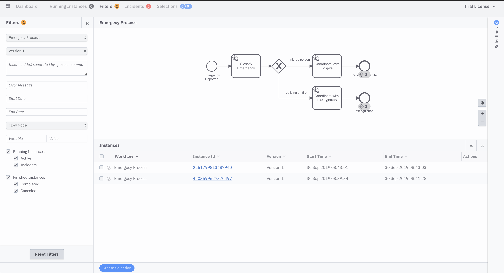

# Zeebe on Kubernetes 
This repository contains the links to get an example application with Zeebe running inside a Kubernetes Cluster. This example also includes an example Workflow Definition and links to a Zeebe Worker based on Spring Boot. This example also includes the use of the Zeebe Modeler and the `zbctl` command line tool. 


# Pre Requisites
- Git / Java / Maven
- Kubernetes Cluster + `kubectl`
  - Local: [Kubernetes KIND](https://github.com/kubernetes-sigs/kind), Minikube, MicroK8s
  - Remote: GKE, Azure, EKS
- HELM cli 
- (Optional) Zeebe Modeler
- (Optional) Zeebe CTL
- (Optional) Spring Boot Zeebe Worker

You can run this example against any Kubernetes Cluster. 

You can also find a Spring Boot Worker which implements the `classify`, `hospital` and `firefighters` workers for the `BPMN Service Tasks` included in the example process here [Zeebe Spring Boot Example Worker](https://github.com/salaboy/zeebe-worker-spring-boot-example)

# Install Zeebe Helm Charts into your Kubernetes Cluster

Follow the official documentation on how to install the official [Zeebe  Helm Charts](https://stage.docs.zeebe.io/kubernetes/README.html) into Kubernetes. 

### Zeebe Modeler
If you are in Mac OSX you can install it with homebrew:
```
> brew cask install zeebe-modeler
```

Or download from here: [Zeebe Modeler Releases](https://github.com/zeebe-io/zeebe-modeler/releases)

You can open and modify the [`emergency-process.bpmn`]() file with it now. 

## Checking Zeebe Installation
```
> kubectl get pods
```

Should return something like: 
```
NAME                                                   READY   STATUS    RESTARTS   AGE
elasticsearch-master-0                                 1/1     Running   0          10m
elasticsearch-master-1                                 1/1     Running   0          10m
elasticsearch-master-2                                 1/1     Running   0          10m
<RELEASE NAME>-nginx-ingress-controller-5cf6dd7894-s9xkr      1/1     Running   0          10m
<RELEASE NAME>-nginx-ingress-default-backend-f5454db5-8jgpq   1/1     Running   0          10m
<RELEASE NAME>-operate-5d4867d6d-qxqq5                        1/1     Running   2          10m
<RELEASE NAME>-zeebe-0                                        1/1     Running   0          10m
<RELEASE NAME>-zeebe-1                                        1/1     Running   0          10m
<RELEASE NAME>-zeebe-2                                        1/1     Running   0          10m
```

## Interact with the services inside the Cluster
In order to interact with the services inside the cluster you need to use `port-forward` to route traffic from your environment to the cluster. 
```
> kubectl port-forward svc/<RELEASE NAME>-zeebe 26500:26500
```

Now you can connect and execute operations against your newly created Zeebe cluster. 
Notice that you need to keep running the `port-forward` command to be able to communicate with the remote cluster.

### Using the Zeebe CLI - Command Line Interface (zbctl)
You can get the `zbctl` tool from the official [Zeebe Release Page](https://github.com/zeebe-io/zeebe/releases) 

`zbctl` by default is configured to point to `localhost:26500` to interact with a cluster, and because we are running `port-forward` from our environment to the cluster, our `26500` port is redirected to the cluster service. 

Download and add `zbctl` to your `PATH`, and now you can check the connection with your cluster:
```
> zbctl status --insecure
```

This should return something like this: 
```
Cluster size: 3
Partitions count: 3
Replication factor: 3
Brokers:
  Broker 0 - salaboy-zeebe-0.salaboy-zeebe.default.svc.cluster.local:26501
    Partition 1 : Follower
    Partition 2 : Leader
    Partition 3 : Follower
  Broker 1 - salaboy-zeebe-1.salaboy-zeebe.default.svc.cluster.local:26501
    Partition 1 : Leader
    Partition 2 : Follower
    Partition 3 : Leader
  Broker 2 - salaboy-zeebe-2.salaboy-zeebe.default.svc.cluster.local:26501
    Partition 1 : Follower
    Partition 2 : Follower
    Partition 3 : Follower
```

Once you have your connection to your cluster you can deploy our process defintion by running: 
```
> zbctl deploy emergency-process.bpmn --insecure
```

Next step is to create Workflow Instances. Notice that you can send variables: 
```
> zbctl create instance EMERGENCY_PROCESS --variables "{\"emergencyReason\" : \"person\"}" --insecure
```

or/and
```
> zbctl create instance EMERGENCY_PROCESS --variables "{\"emergencyReason\" : \"building on fire\"}" --insecure
```

## Accessing Operate from outside the cluster
The `Zeebe Full HELM Charts` install an Ingress Controller. If this is deployed in a cloud provider, it should provision a LoadBalancer which will expose an External IP that can be used as the main entry point to access all the services/applications that are configured to have Ingress Routes. 

You can find the External IP by running: 
```
> kubectl get svc
```

You should see something like: 
```
NAME                                    TYPE           CLUSTER-IP       EXTERNAL-IP   PORT(S)                                  AGE
<RELEASE NAME>-nginx-ingress-controller        LoadBalancer   10.109.108.4     <pending>     80:30497/TCP,443:32232/TCP               63m
```

Where the `<pending>` under the `EXTERNAL-IP` column should change to a public IP that you (and other users) should be able to access from outside the Cluster. You might need to check your Cloud Provider specific configuration if that doesn't work. 

If you are running in Kubernetes KIND, you will need to `port-forward` to the Ingress Controller main entry point due KIND doesn't support LoadBalancers. You can do that by running in a different terminal:
```
> kubectl port-forward svc/<RELEASE NAME>-nginx-ingress-controller 8080:80
```

Then you should be able to access Operate at [http://localhost:8080](http://localhost:8080/)

Using `demo`/`demo` for credentials. 

At this point, if you create two process instances you will see that they are both stuck at the `Classify Emergency` task. This is because you don't have workers for such tasks, so the process will wait in that state until we provide one of these workers. 

### Starting a simple Spring Boot Zeebe Worker

Clone and run the Simple Zeebe Spring Boot Worker:
```
> git clone https://github.com/salaboy/zeebe-worker-spring-boot-example
> cd  zeebe-worker-spring-boot-example/
> mvn spring-boot:run
```

Once again, the worker is configured by default to connect to `localhost:26500` to fetch Jobs. If everything is up and running the worker will start and connect, automatically completing the pending tasks in our Workflow Instances. 
If you refresh Operate (http://localhost:8080) you will find both Instances completed:


